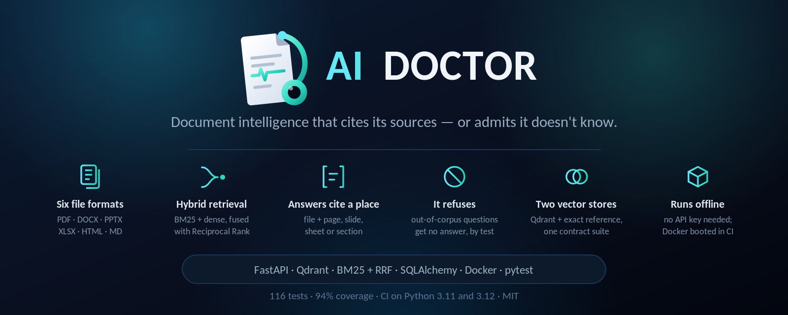
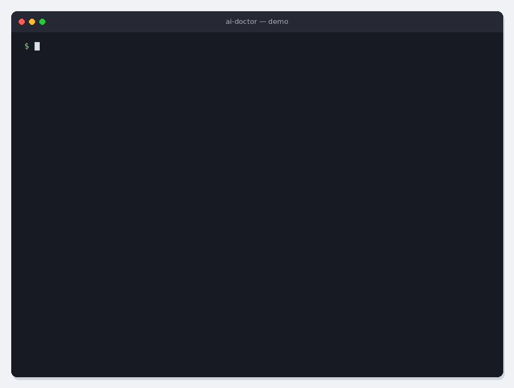
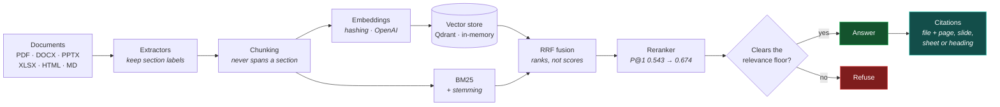
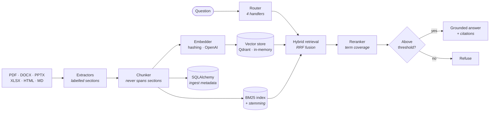

<p align="center">
  
</p>

# AI Doctor
### Production-Grade Document Intelligence & Grounded Retrieval-Augmented Generation (RAG)

**Ask questions of your own PDFs, Word documents, slide decks and spreadsheets.
Every answer names the file and the page it came from — or says it doesn't know.**

[](https://github.com/saianthireddy/ai-doctor/actions/workflows/ci.yml)
[](https://github.com/saianthireddy/ai-doctor/actions/workflows/docker.yml)
[](https://github.com/saianthireddy/ai-doctor)
[](#testing)
[](#testing)
[](LICENSE)
[](https://github.com/astral-sh/ruff)

> ### ⚠️ Not medical software
> Despite the name, **AI Doctor diagnoses documents, not people.** It provides no
> medical, clinical, diagnostic or health advice of any kind, and must not be used
> for any such purpose. The name refers to examining a document corpus.

<p align="center">
    
</p>

---

## What it does



Point it at your PDFs, Word documents, slide decks, spreadsheets, HTML and
Markdown. It extracts them with structure intact, chunks them without splitting
mid-thought, indexes them for both **semantic** and **keyword** retrieval, fuses
and reranks the results, and answers questions **with citations naming the file
and the page, slide, sheet or heading.**

And when the answer isn't in your corpus, it says so instead of guessing:

```
$ python scripts/demo.py

[ANSWERED] intent=answer confidence=0.7
Q: how do I reset my password
A: To reset your password open Settings and choose Reset Password.
Sources: [handbook.docx, Password reset]

[ANSWERED] intent=lookup confidence=0.55
Q: what does ERR_LOCK_TIMEOUT mean
A: ERR_LOCK_TIMEOUT indicates the work queue is saturated.
Sources: [handbook.docx, Troubleshooting]

[REFUSED ] intent=answer confidence=0.0
Q: who won the 1998 world cup
A: I could not find this in the indexed documents...
```

**Runs with zero configuration.** No API key, no database to provision, no vector
service to start. `pip install -e .` and `make run`.

---

## Status — what's real, what isn't

Most portfolio READMEs list every technology the author has heard of. This one
tells you exactly what is implemented, what is declared, and what is not built,
because a claim you can't check is worth less than a smaller one you can.

| Capability | Status | Verified by |
|---|---|---|
| PDF / DOCX / PPTX / XLSX / HTML / Markdown extraction | ✅ **Implemented** | 14 tests against real generated files |
| Section-aware chunking with overlap | ✅ **Implemented** | 12 tests |
| Hashing embeddings (offline) | ✅ **Implemented** | 12 tests |
| Qdrant vector store (embedded mode) | ✅ **Implemented** | 11 tests, incl. parity vs exact search |
| In-memory vector store (exact cosine) | ✅ **Implemented** | same contract suite |
| BM25 lexical search with stemming | ✅ **Implemented** | 6 tests |
| Hybrid retrieval via Reciprocal Rank Fusion | ✅ **Implemented** | 10 tests |
| Reranking (term coverage + phrase) | ✅ **Implemented** | 5 tests |
| Grounded answers with citations | ✅ **Implemented** | 7 tests |
| **Refusal when out-of-corpus** | ✅ **Implemented** | 6 tests; **measured: answers 33% of unanswerable questions** — see [evaluation](docs/evaluation.md#refusal) |
| Labelled retrieval evaluation | ✅ **Implemented** | 52 questions, 24 tests, [published numbers](docs/evaluation.md) |
| Intent router over 4 handlers | ✅ **Implemented** | 6 tests |
| FastAPI REST API + OpenAPI | ✅ **Implemented** | 18 tests |
| SQLAlchemy metadata store | ✅ **Implemented** | 8 direct contract tests, on both engines |
| Docker image (multi-stage, non-root) | ✅ **Implemented** | built **and booted** in CI |
| OpenAI embeddings + chat generation | 🟡 **Written, unverified** | 12 tests cover the request/response handling **against a stub**; the API itself is never called (needs a key) |
| Cross-encoder reranking | ✅ **Implemented** | 5 behavioural tests against the **real model** in CI |
| Postgres backend | ✅ **Implemented** | 8 contract tests against a **real Postgres service** in CI |
| Qdrant *server* mode | ✅ **Implemented** | the **same contract suite** as embedded, against a real server in CI |
| Knowledge graph, Celery workers, K8s, Terraform | ❌ **Not built** | see [ROADMAP.md](ROADMAP.md) |

🟡 means the code exists and is structured behind an interface, but **no test
proves it works** — the one remaining case needs an API key CI doesn't have.
❌ means it isn't there at all. Neither is claimed as working.

---

## Measured, not asserted

52 labelled questions over the sample corpus — 46 answerable, 6 that the corpus
cannot answer. Reproduce with `python scripts/evaluate.py`.

| Strategy | P@1 | R@10 | MRR | nDCG@10 |
|---|---:|---:|---:|---:|
| dense only | 0.522 | 0.790 | 0.616 | 0.641 |
| lexical only (BM25) | 0.543 | 0.833 | 0.669 | 0.686 |
| hybrid (RRF) | 0.543 | 0.822 | 0.650 | 0.676 |
| **hybrid + rerank** | **0.674** | **0.844** | **0.748** | **0.752** |

Two results worth stating plainly, because neither flatters the design:

**Hybrid retrieval does not beat BM25 alone on this corpus.** Fusion is a hair
*worse* than lexical by itself. The likely cause is the offline hashing
embedder, which is semantically blind by construction — RRF is fusing a weak
list into a decent one. If hybrid still loses once real embeddings are wired in,
the fusion isn't earning its place and should go.

**The refusal gate answers 33% of unanswerable questions.** It catches the
absurd ones and misses the plausible ones: *"what is the parental leave policy"*
gets answered, confidently, from the handbook's **annual** leave section. The
relevance floor moved from 0.12 to 0.15 because the sweep showed that cuts false
answers by a third while wrongly refusing nothing — but the remaining failures
are semantic near-misses a lexical floor cannot catch.

The benchmark is built so it can fail: a saboteur retriever that ignores the
query is scored alongside the real one in CI, and the suite fails if they
converge. Full method, threshold sweep and limitations in
**[docs/evaluation.md](docs/evaluation.md)**.

---

## Quickstart

```bash
git clone https://github.com/saianthireddy/ai-doctor.git
cd ai-doctor

python -m venv .venv && source .venv/bin/activate
pip install -e ".[dev]"

make test        # 162 tests offline; 17 more need CI's services and extras
make demo        # ingest the sample corpus and ask it questions
make run         # serve on http://localhost:8000  (docs at /docs)
```

With Docker:

```bash
make docker && make docker-run
curl localhost:8000/api/v1/health
```

Ingest and ask:

```bash
curl -F "file=@handbook.docx" localhost:8000/api/v1/ingest
curl -X POST localhost:8000/api/v1/ask \
     -H 'content-type: application/json' \
     -d '{"question":"how do I reset my password"}'
```

---

## Architecture



Full write-up in [docs/architecture.md](docs/architecture.md).

---

## Design decisions worth defending

Six choices that a reviewer might question, and why they're the way they are.

### Hybrid retrieval isn't a buzzword here — it's load-bearing

Dense retrieval fails on exactly the queries enterprise users care about most.
An embedding smears `ERR_LOCK_TIMEOUT` into "something about errors"; BM25 matches
the literal token. Both paths are indexed together so they can't drift apart, and
they're fused by **Reciprocal Rank Fusion** rather than by normalising and adding
scores — BM25 is unbounded and corpus-dependent while cosine sits in [-1, 1], so
any normalisation is a hidden weighting that shifts as the corpus grows. RRF
discards magnitudes and fuses ranks.

### Refusing is a feature, and it took a real bug fix to work

A knowledge assistant that always answers is worse than one that sometimes says
"not in the corpus". During development, *"what is the airspeed velocity of an
unladen swallow"* scored **0.25** and cleared the relevance floor — because
coverage was counting stopwords, and `what/is/the/of/an` overlap with any
passage. That defeated the entire gate. Content-word-only coverage plus a
zero-score rule when nothing topical matches fixed it, and
`test_out_of_corpus_question_is_refused` now guards three such questions.

### Spreadsheet headers are repeated onto every row

A retrieved chunk reading `EMEA | 1200` is unanswerable. `Region: EMEA | Amount:
1200` is. The header is the only thing that makes a cell mean anything, and
chunking will eventually separate the two — so they're joined at extraction time.
Formulas are read as cached values, because `=SUM(B2:B9)` is not the answer to a
question about a number.

### Chunks never span two sections

A chunk covering the end of "Installation" and the start of "Billing" can't be
cited honestly and dilutes both topics in the embedding. Sections are hard
boundaries even when that leaves a short chunk. Splitting falls back
paragraph → sentence → hard window, in that order; a character window is the last
resort, not the default, because that's what produces `…hold the power butt / on
for ten seconds`.

### A scanned PDF is an error, not an empty success

A PDF with no text layer yields nothing. Returning an empty document would look
like a successful ingest and surface days later as "the assistant can't find
anything" with no clue why. It raises, naming OCR as the likely cause. **There is
no OCR here** — that's a documented limitation, not a hidden one.

### The offline defaults are a floor, and they're labelled as such

The default embedder is a bag-of-hashed-tokens projection, **not** a semantic
model — token overlap is all it can see. The default generator is *extractive*: it
selects sentences from retrieved passages rather than generating prose, which
means it literally cannot hallucinate, and also cannot paraphrase or reconcile two
sources. Both exist so the platform runs and is testable anywhere. Swap in OpenAI
via environment variable when you want real quality. The reranker is named
`lexical-overlap` rather than "cross-encoder" because that is what it is.

---

## Testing

```bash
make cov
```

**179 tests, 93% coverage.** 162 run offline in ~3s. The other 17 need things a
laptop shouldn't have to install: Postgres and Qdrant *server* mode run against
real service containers in CI, and the cross-encoder runs against the real model.

| Suite | Focus |
|---|---|
| `tests/extractors/` | All six formats against **real generated files** |
| `tests/test_chunker.py` | Boundary rules, overlap, determinism |
| `tests/test_embeddings.py` | Norms, similarity ordering, NaN safety |
| `tests/vectorstore/` | Both backends against **one shared contract** |
| `tests/retrieval/` | BM25, stemming, RRF properties |
| `tests/agents/` | Answering, **refusal**, reranking, routing |
| `tests/api/` | Every endpoint and every error status |
| `tests/integration/` | End-to-end per format, plus determinism |

Two things this suite does deliberately:

**It generates real files rather than mocking the libraries.** Mocking `pypdf`
would only prove the mock behaves like the mock. The failures worth catching live
in how these formats actually serialise, so `reportlab`, `python-docx`,
`python-pptx` and `openpyxl` produce genuine files in fixtures.

**Both vector backends run the same test class.** The in-memory store does exact
cosine, so it's the oracle: `test_qdrant_and_memory_agree_on_ranking` asserts the
two return identical ordering. An interface claim nothing checks is just a
comment.

### Bugs these tests caught during development

| Bug | Symptom |
|---|---|
| Stopword coverage defeated the refusal gate | Out-of-corpus question answered at 0.25 confidence |
| HTML headings ran into body text | `"SetupInstall the agent"` |
| No stemming in BM25 | "charged for seats" matched nothing against "per-seat charges" |
| `dimensions or 384` | Explicit `0` silently became `384` |
| SQLite `:memory:` without `StaticPool` | `no such table: documents` — every connection got a fresh DB |
| Qdrant accepted a zero query vector | Returned arbitrary results where the reference store returned none |
| A `coverage`/`codecov` exclusion used `file:Symbol` syntax | Both take *path* globs, so the line silently did nothing while looking deliberate |
| Two of four factory guards were untested | `build_llm` and `build_reranker` never had their "unknown name" path exercised |

---

## API

Interactive docs at `/docs`. Full reference in [docs/api.md](docs/api.md).

| Method | Path | Purpose |
|---|---|---|
| `POST` | `/api/v1/ingest` | Upload and index a document |
| `GET` | `/api/v1/documents` | List indexed documents |
| `DELETE` | `/api/v1/documents/{id}` | Remove a document and its chunks |
| `POST` | `/api/v1/ask` | Ask a question; get an answer or a refusal |
| `POST` | `/api/v1/search` | Retrieve passages (`hybrid` \| `dense` \| `lexical`) |
| `GET` | `/api/v1/health` | Status and active backends |
| `GET` | `/api/v1/metrics` | Counts, dimensions, supported formats |

Status codes carry meaning and are individually tested: `415` unsupported type,
`422` supported type but unreadable file, `413` too large, `400` empty, `404`
unknown document.

---

## Configuration

Everything is optional — see [.env.example](.env.example).

| Variable | Default | Notes |
|---|---|---|
| `VECTOR_BACKEND` | `qdrant` | `qdrant` (embedded) or `memory` |
| `QDRANT_URL` | — | Set to use a Qdrant **server** instead of embedded |
| `EMBEDDER` | `hashing` | `hashing` (offline) or `openai` |
| `RERANKER` | `lexical-overlap` | `none`, `lexical-overlap`, `cross-encoder` |
| `LLM` | `extractive` | `extractive` (offline) or `openai` |
| `DATABASE_URL` | `sqlite:///./data/aidoctor.db` | Any SQLAlchemy URL. Postgres needs `pip install -e ".[postgres]"` for the driver |
| `MIN_RELEVANCE` | `0.15` | Below this, answers are refused |

---

## Project layout

```
src/aidoctor/
  extractors/    six formats behind one registry
  services/      chunking, ingestion, answering
  embeddings/    hashing (offline) + OpenAI
  vectorstore/   Qdrant + in-memory, one contract
  retrieval/     BM25, RRF hybrid fusion
  reranker/      coverage-based + cross-encoder
  llms/          extractive (offline) + OpenAI
  agents/        intent router over 4 handlers
  database/      SQLAlchemy metadata store
  api/           routes, schemas, wiring
  config/        environment settings
docs/            architecture, api, deployment, evaluation
tests/           179 tests mirroring src/
examples/corpus/ sample documents for the demo
```

---

## Documentation

| Document | Contents |
|---|---|
| [architecture.md](docs/architecture.md) | Pipeline, interfaces, data flow |
| [api.md](docs/api.md) | Endpoint reference with examples |
| [deployment.md](docs/deployment.md) | Docker, Compose, production paths |
| [ai-agents.md](docs/ai-agents.md) | The router, honestly described |
| [vector-search.md](docs/vector-search.md) | Hybrid retrieval and RRF |
| [evaluation.md](docs/evaluation.md) |Method, threshold sweep and published numbers |
| [CONTRIBUTING.md](CONTRIBUTING.md) · [SECURITY.md](SECURITY.md) · [CODE_OF_CONDUCT.md](CODE_OF_CONDUCT.md) · [ROADMAP.md](ROADMAP.md) · [CHANGELOG.md](CHANGELOG.md) | |

---

## Limitations

Stated plainly, because you'll find them anyway:

- **No OCR.** Scanned PDFs are rejected with a clear error rather than ingested empty.
- **The default embedder isn't semantic.** Hashing sees token overlap only.
- **Single-node.** In-process ingestion, no distributed queue.
- **No auth.** There's no authentication layer; don't expose this publicly as-is.

## License

[MIT](LICENSE)
