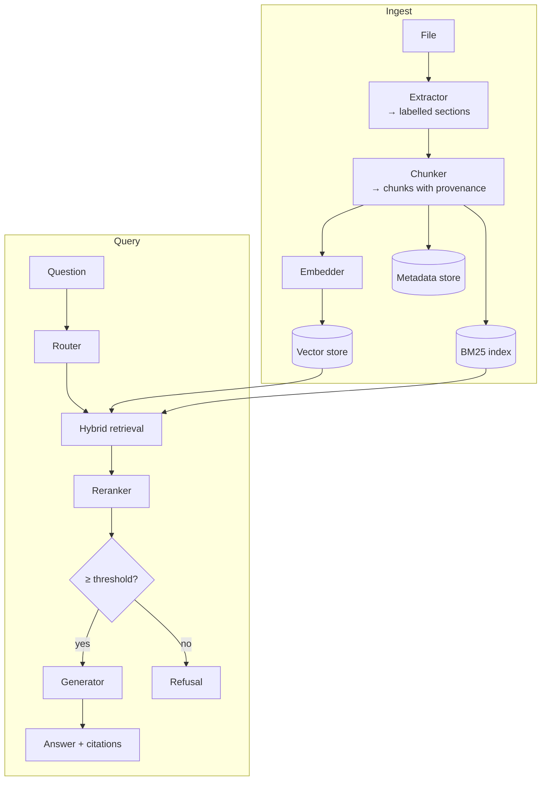

# Architecture

## The shape of it

Six stages, each behind an interface so the one after it does not know how the one
before it works.

## Why sections exist

An extractor does not return a string. It returns **sections** — a text block with
a human-facing label (`page 3`, `slide 2`, `sheet Sales`, `Installation`).

Two things depend on this:

1. **Citations can name a place.** `[handbook.docx, Billing]` is actionable;
   `[handbook.docx]` is not.
2. **The chunker has boundaries it must not cross.** Without sections, chunking is
   a character window over one flat string, and a chunk can straddle two unrelated
   topics.

Everything downstream of extraction is therefore format-agnostic. Adding a new
file type touches exactly one directory.

## The interfaces

| Protocol | Methods | Implementations |
|---|---|---|
| `Extractor` | `extract` | PDF, DOCX, PPTX, XLSX, HTML, Text |
| `Embedder` | `embed_one`, `embed_many` | Hashing, OpenAI |
| `VectorStore` | `upsert`, `search`, `delete_document`, `count`, `all_chunks` | Qdrant, in-memory |
| `Reranker` | `rerank` | none, lexical-overlap, cross-encoder |
| `LLM` | `complete` | extractive, OpenAI |

Each is a `typing.Protocol`, so implementations do not inherit from anything —
they just satisfy the shape. The vector store interface is five methods on
purpose: wider and swapping backends stops being a config change, narrower and
the retriever has to reach around it.

## Identity and idempotence

Chunk ids are `sha256(doc_id + section_label + ordinal + text_prefix)`. That makes
re-ingest **idempotent by construction**: the same file produces the same ids, and
`upsert` replaces rather than appends.

This is designed in rather than fixed later because the failure is silent. A
sibling project used random UUIDs, so re-crawling a two-page site left six page
rows and every chunk indexed three times — search kept ranking triplicated
content and nothing errored.

Ingestion also **deletes before it writes**, so an edited document cannot leave
orphaned chunks from its previous version answering questions.

## Retrieval

Dense and lexical indexes are owned by one `HybridRetriever` and populated by one
`index()` call. Two entry points is how a corpus ends up half-indexed, with
lexical hits for chunks dense search cannot see.

Fusion is **Reciprocal Rank Fusion**: `score = Σ weight / (k + rank)`. See
[vector-search.md](vector-search.md) for why rank fusion rather than score
normalisation.

## The refusal gate

Between retrieval and generation sit two checks:

1. **Relevance floor** — if the best reranked passage is below `MIN_RELEVANCE`,
   refuse.
2. **Grounding** — if the generator produced nothing traceable to a passage,
   report ungrounded rather than surface it as an answer.

This gate is the reason the reranker excludes stopwords from its coverage
calculation. With stopwords counted, *"what is the airspeed velocity of an unladen
swallow"* scored 0.25 against a corpus about password resets, because
`what/is/the/of/an` overlap with everything.

## Where state lives

| Store | Holds | Why separate |
|---|---|---|
| Vector store | chunks + embeddings | Re-embed when the model changes |
| BM25 index | chunk tokens | In-process, rebuilt from chunks |
| Metadata store | ingest records | Answer "what do we have?" without touching the index |

The BM25 index is in-process and not persisted. That is a real limitation: a
restart requires re-ingestion to restore lexical search. It is on the roadmap
rather than hidden.

## Configuration boundary

`build_container()` is the only place that reads settings and constructs
implementations. Nothing else imports `settings`. That is what makes the backend
swap genuinely a config change — and it is why tests can build an isolated stack
without monkeypatching module globals.
